#### 背景介绍
本篇文章主要梳理当前京东到店的核心流程，辅助大家对同城业务的系统流转进行理解。因为是大的流程，很多内容不太细致，感兴趣的细节点可以分专题再进行讨论，这篇文章你将get如下几个主要知识点：
- POP的概念和模式
- LOC的概念和模式
- 前台类目、后台类目、店内分类、门店类目的关系
- 到店业务生产环节和普通实物订单生产的区别等


#### 同城到店的业务模式
同城到店的业务模式是线上销售线下持码到店服务的模式，用户购买后前往线下门店凭码核销并兑换相应服务或商品，其主要的核心流程如图所示：
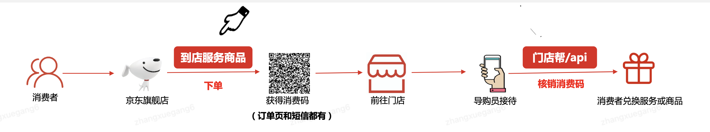


我们看到他与普通的交易流程区分不大，主要是商户的产品对C端用户进行售卖的过程，生产履约h环节有一定的区别，从物流配送，变为到店消费。下面核心我围绕对京东主流程不太熟悉的小伙伴，进行大流程的讲述，其中涉及到的感兴趣的细节点，如有感兴趣的，可以再进行分享与讨论。


#### 名词解释
| 名称    | 解释        | 
| ----------- | ------------- | 
| POP      | Platform Open Plan，是京东的“平台开放计划”,就是京东为商家提供销售商品的平台，商家入驻京东POP 开放平台后，可运用京东强大的交易、仓储、配送、客服等系统直接服务于自己的店铺。POP目前主要包含四种合作模式：FBP、LBP、SOP和SOPL。这几种合作模式后续会有所介绍|
| LOC     | 本地生活服务（Local life service）是将当地、线下、具有实体店铺的餐饮、生活服务、休闲娱乐等商家服务信息，以一种“网店”的方式呈现给网民。通过本地生活服务的平台，帮助用户看到所在地的商户，给用户提供便捷、全面的商户信息，给线下商户提供免费的推广渠道|
|   生产流程 | 实物的订单生产一般是订单下发ofc->开始履约->物流；到店的生产流程，一般是说LOC订单从支付成功后下传至POP-LOC订单系统起，到推送至POP结算系统止，中间的过程为订单生产流程。|
|  生产节点  |生产流程中的每一个环节称为一个生产节点，包括：生成码（京东生产、商家推送、腾讯视频 ）、发短信（京东发短信、商家发短信、腾讯视频发短信）、码核销（核销京东码、核销商家码）、订单状态变更、推送结算（根据订单结算、根据码结算、无码结算）、减库存、业务信息通知。|
| 业务规则|将各生产节点按照一定的顺序组装配置而成的生产流程，叫做业务规则。|
| 业务模式|目前包括6种业务模式：到店服务、在线服务、房产服务、报名服务、视频服务、挂号服务。这些业务模式基本划分为三大业务模式：第一种，以电子凭证为主的交易链路，帮助商家在京东域内售卖商品（门店库存不影响业务）或服务，比如体检服务、洗车服务等；第二种，线上销售线索，线下完成交易支付尾款的模式，比如房产服务，线上支付定金，线下看房，签订合同；飞龙项目，线上售卖门店代金劵，线下体验，支付尾款；第三种，服务和实物组合模式，帮助用户购买实物同时享受其他服务，比如购买轮胎，赠送到店安装服务。|

#### 核心流程
要完成上边图的业务流程，在运营视角他需要完成商户的入驻-->建店-->发品-->交易-->发码-->核销-->售后-->结算这些流程，下面的部分我会拆开讲这几部分的内容，并尽可能的说一下主站流程和到店业务的差异点。

#### 入驻开店流程

##### 说一说POP

在介绍入驻之前还是要讲一下POP，POP ( Platform Open Plan）,就是京东为商家提供销售商品的平台，商家入驻京东POP开放平台后，可运用京东强大的交易、仓储、配送、客服等系统直接服务于自己的店铺。

```有意思的是POP创始人曾经说过，POP是京东造出来的一个词，现在很多商户也叫自己的开放平台叫POP了，其实POP的全称是Plan of Open Platform ，这个词是老刘起的，2009年底他在医院的病床上，我向他汇报工作时他说京东的开放平台就叫POP吧```


那京东为什么发展POP呢？
- POP全面扩充京东的商家、品牌及商品品类，以保持商品的多样化和个性化，保证物美价优。
- POP可扩大流量规模，活跃用户数大增，进一步提升销售收入。
- POP业务可收取高额佣金、配送费、服务费等，增加京东利润。
- POP直接扩大规模，提升行业排名，并提高京东GMV，有利于京东资本市场运作等。

POP最重要的合作模式有如下几种：
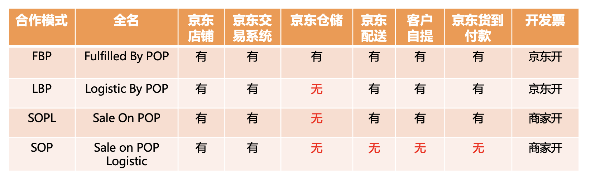
我们看到合作模式就是使用京东不同的能力（京东店铺、交易、仓储、配送、结算....）

总结这几种合作模式：
- FBP：什么都用京东的，相当于京东自营；
- SOP：只用你的交易系统，相当于淘宝；
- LBP：淘宝+京东快递+京东开发票；
- SOPL：淘宝+京东快递+商家开发票；

我们可以看到到店的业务，其实是一种SOP的合作模式。LOC业务是将当地线下、具有实体店铺的餐饮、生活服务、休闲娱乐等商家服务信息，以一种“网店”的方式呈现给网民。通过本地生活服务的平台，帮助用户看到所在地的商户，给用户提供便捷、全面的商户信息，给线下商户提供免费的推广渠道。
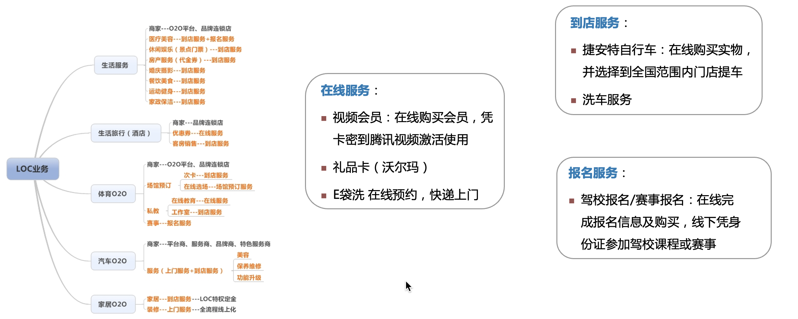


POP的主要产品线主要分为了实物和虚拟，以前的研发部门也是这样去划分的，虚拟是专门的研发部，现在好像也没有那么明确的划分了
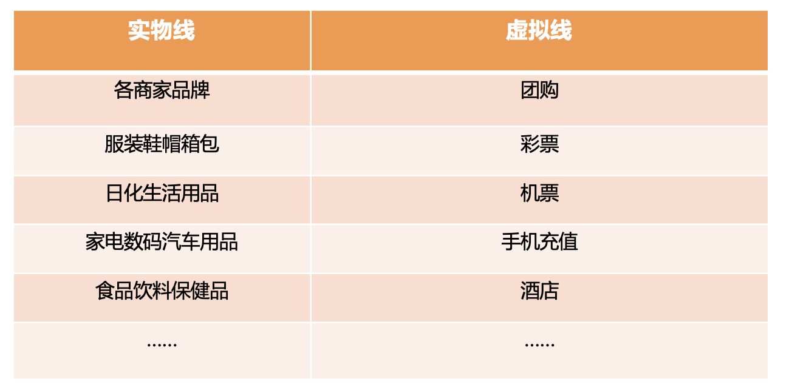

##### POP商家的入驻
同城商户在入驻层面和普通商户入驻当前并没有太大的差别，当前是使用的平台生态部的系统进行入驻，入驻有两种方式，一种是商家自主从 shop.jd.com (商家管理后台shop端)进行入驻，一种是通过 man.jd.com (POP运营管理后台man端)进行入驻。在shop端入驻的流程是：资料准备-在线提交-质控审核-招商复审-创建店铺-开店任务-正式经营。man端入驻的流程为资料准备-后台新增-设置店铺-设置审核-开店任务-正式经营。后台开店主要是满足一些不熟悉开店流程的重点客户，进行快速的开店。
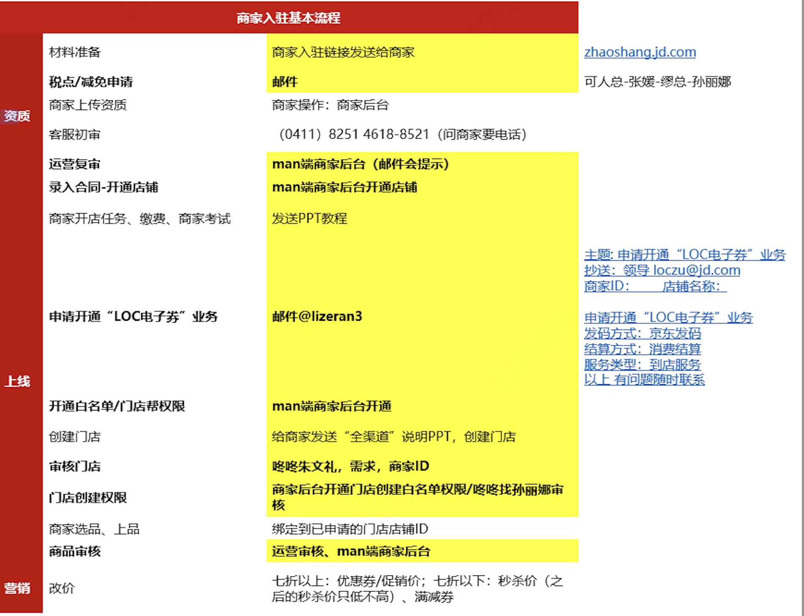

感兴趣的小伙伴可以在开放平台去看看怎么入驻，这里特别说明一下，到店这块有一个特殊的环节，在门店创建的时候，有门店权限这一部分，POP运营可以为商家设置属性，其操作路径为：京东man端（man.jd.com）->商家->商家信息管理->商家属性设置，根据商家实际情况可以开通如下属性：

1）门店帮：选开开通后，支持创建导购员角色，用于登录“jd门店助手”公众号查询和核销到店服务订单

2）门店账号创建：选开开通后，在创建门店时需维护门店账号和密码，用于登录门店系统查询和核销到店服务订单

3）分门店定价：选开开通后，每个门店可以以不同价格销售同一个SKU商品，用户下单选择哪个门店（仅针对下单选择门店情况适用）

##### 创建门店
商家登录shop端，或者登录到店小程序，京麦管理后台，现在到店也有自己的商家小程序，也可以做同样的事情，这里为了阐述流程以PC为例：商家登录shop端-店铺管理-门店管理：
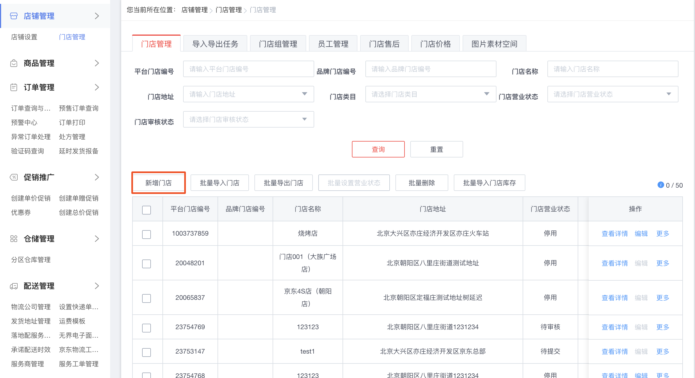

点击创建门店进行门店的创建
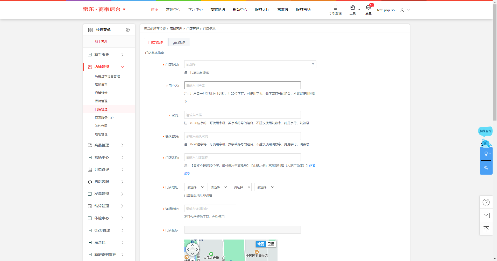
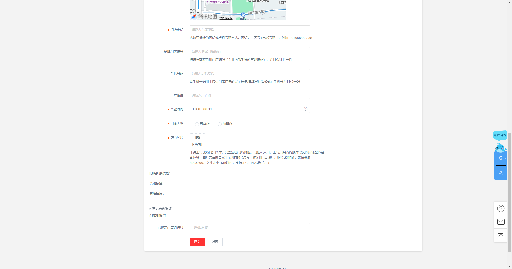


注意：门店需要按照选择的类目维护对应的门店资质，如门店类目为“健康医疗-药店”，则需要上传如下门店资质：
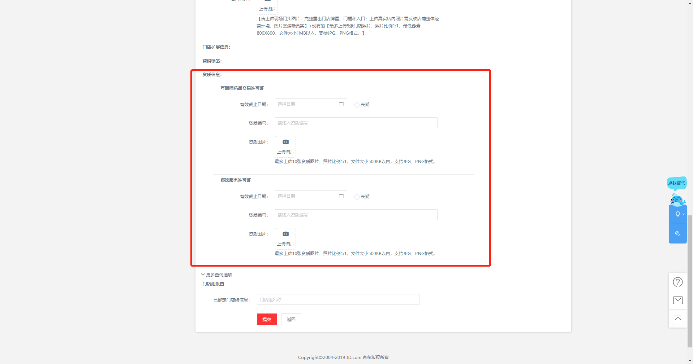

门店上传资质后，需要商家运营在man端审核。

````此外门店还可以通过Excel批量完成入驻，也可以通过宙斯开放平台通过接口进行门店的入驻```

##### 创建门店组
讲到门店这里还有一个门店组的概念，说门店组就不得不讲，门店、商品、门店组的爱恨纠缠，门店组是一个独立存在的维度，门店组在创建的时候必须至少关联一个门店，到店商家在发品的时候必须关联一个门店组，相当于品发到了这个门店组下。

如下图所示，商家通过店铺管理-门店管理-门店组管理创建门店组
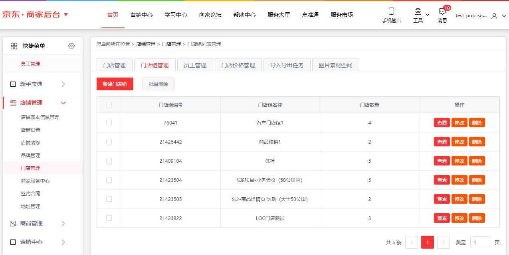

新建门店组必须绑定一个门店
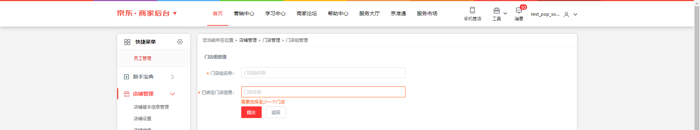

这里值得注意的是，SKU和门店组的关系，以及门店和门店组的关系都可以由商家进行改动，那以上关系的变动，系统需要保障，商品、门店、门店组数据的正确对应。

```此外门店组也可以通过宙斯接口维护门店信息```

当前入驻流程的研发团队为平台生态研发部： 产品负责人：丁泽豪

#### 建品
在说建品之前我先介绍几个概念，这几个概念比较容易混淆，商品类目、店铺分类、门店类目、前台类目，这些类目到底是什么，他们之间是一种怎么样的关系呢？

我们一般所说的商品类目是商品中台的后台类目，也就是现在标准的三级类目，发品时我们选的类目就是指的这个，这个类目是商品中台来维护的，管控也比较严格，由商品运营来集中管控，商家是没有权限去做修改的。
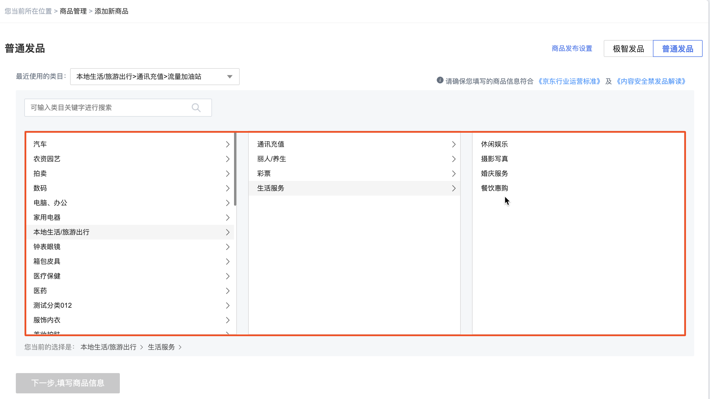


店铺分类又叫店内分类，他的主要作用就是，当用户进入店铺的时候能够在店铺内进行商品的检索，这个类目方便商家来自定义自己所卖的东西，比如下边图：
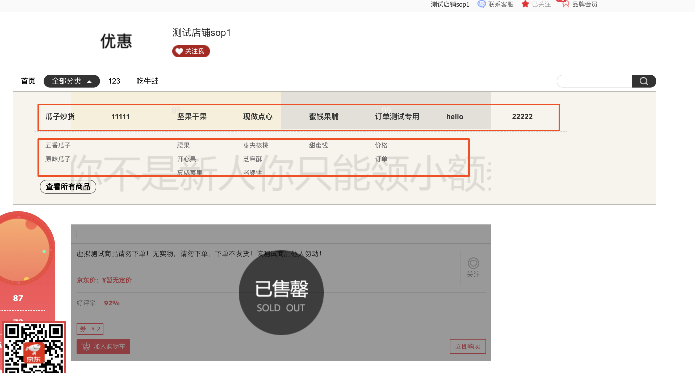


这个类目分类的权限是商家创建和修改的，完全属于店铺。
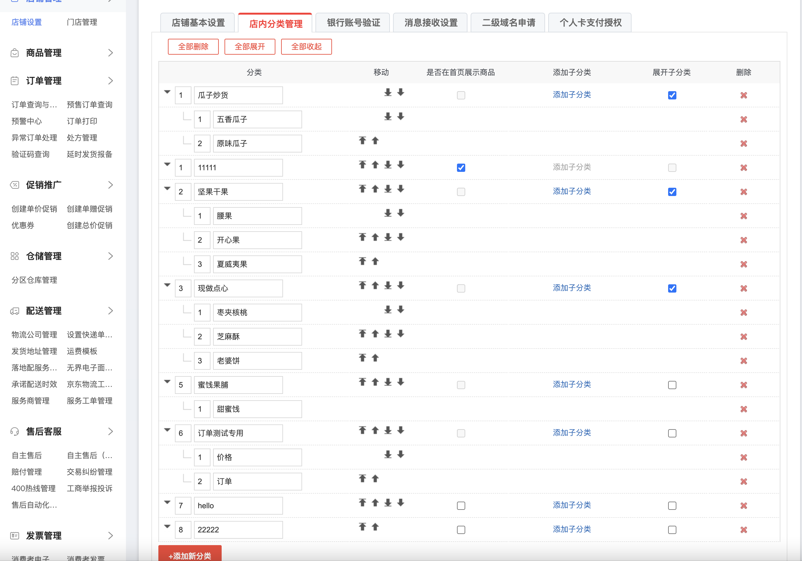

门店类目也属于一种后台的类目，也是为了对门店商品进行分类管理的手段，但是现在全渠道的门店类目不同于7鲜和美团门店类目，他是门店的一个属性，来标识这个门店是属于哪个分类的，一个门店只属于一种类目。下面会讲到这里的设计。
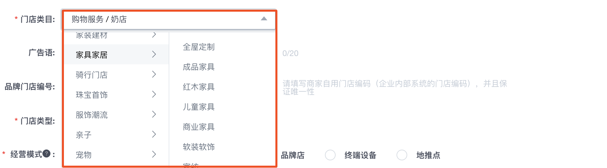

前台类目主要是为了一些营销手段，用户体验等进行的类目设置。因为发品的时候并不会选择发到前台类目所以前台类目后台类目一般是有一层映射关系，以京喜拼拼为例，它是在商品中心-前台分类管理中，对前台类目与后台类目进行绑定，这样小程序会显示前台类目绑定的后台类目下的商品。

以拼拼小程序为例，创建前台类目：
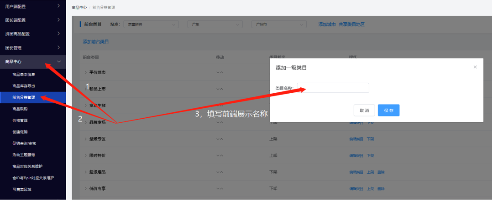

绑定前台类目和后台类目的关系：
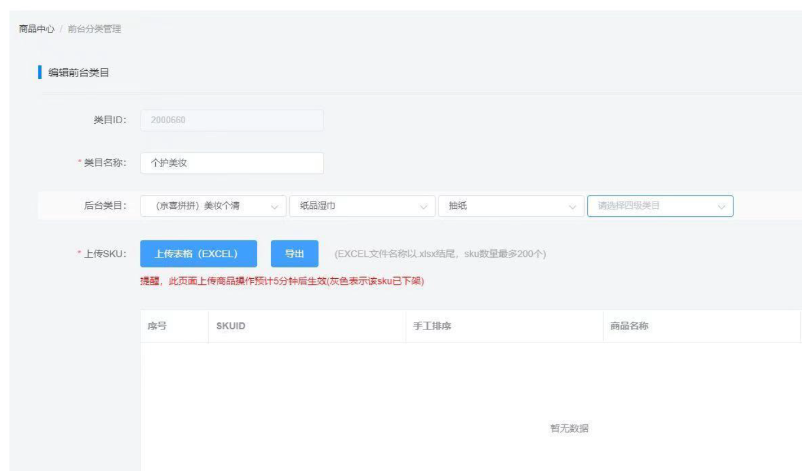

然后发品的时候会选择后台类目，这个时候前台类目和品的关系就建立了。这些前台类目先找到映射的后台类目，然后再找到哪些品发到了这个类目下。
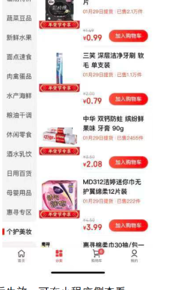

回到咱们同城到店业务上，比如同城到店的频道首页，大家看到的金刚位的类目和商品feed流的类目，我们也叫做前台类目。

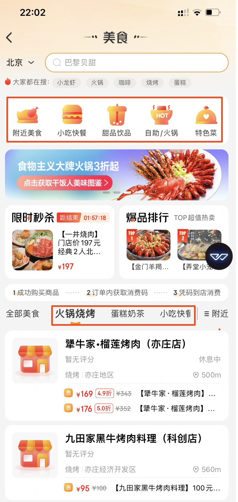

那这个类目和刚才说的有关系么，点击这个前台类目的时候，它其实也是有一个绑定关系的。他的绑定是前台类目会与门店类目做映射。门店类目会与门店做映射。这个时候点击类目的时候就搜索到了门店，我们看到商品feed的的结果其实是门店，这也是因为前台类目绑定的是门店的一个属性（门店类目），关联出门店后又查了门店下的三个品放到了feed流中。到这里大家应该就对类目有一个认识了。

```拼拼前台类目绑定文档参考：https://cf.jd.com/pages/viewpage.action?pageId=1002615090```


讲完类目这些，我们看一下发品的操作，商家登录shop端，点击商品管理-添加新商品
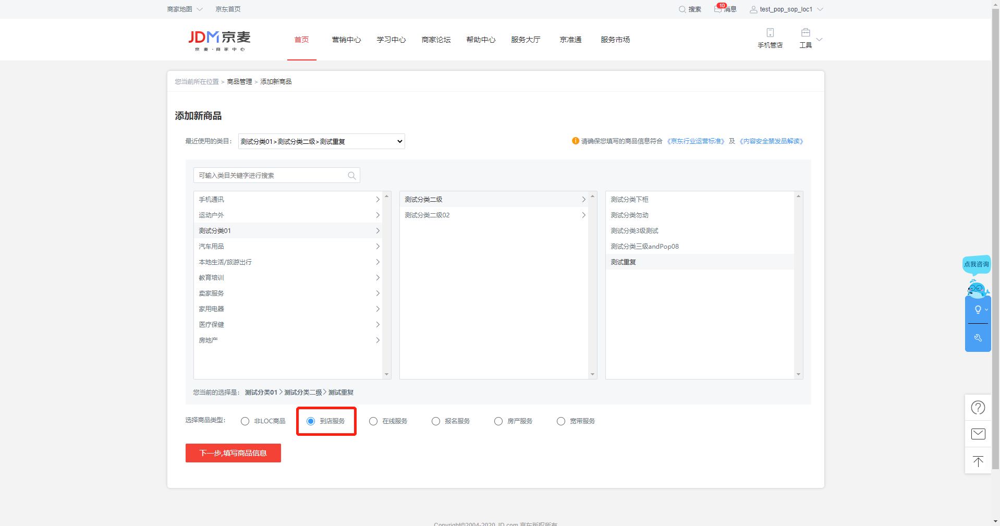

设置商品基本信息，以及到店服务商品的特殊属性，包括【服务类型】、【支持门店组】、【服务有效期】。

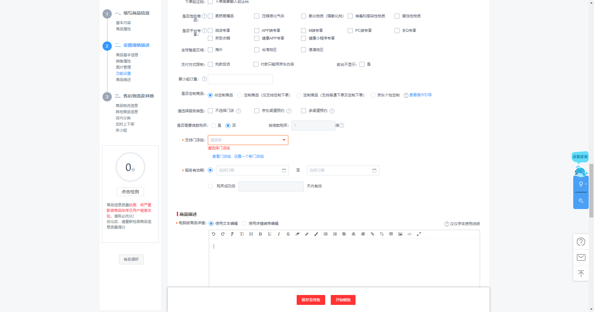
其中：

【服务类型】非必选，默认下单必选门店；若业务需要下单不选门店，则可以勾选“不选择门店”。

【支持门店组】必选，需要选择一个商品对应的门店组。

【服务有效期】必填，可以设置“绝对有效期”的开始时间和结束时间，或“相对有效期”，即顾客购买之后多长时间有效。

我们可以看到门店组，服务类型以及服务有效期这些特性的到店参数，也能看到到店服务与普通实物数据存储结构上的不同。

```此外商家也可以通过宙斯进行商品信息的维护```


#### 黄金流程

我先把整个交易流程怎么去做的，给大家演示一遍，然后会说这个流程中他与主站的一些区别，再去分析他背后的逻辑。

（1）搜索下单，支付成功后获得验证码及短信，现在到店这块应该还没有在主搜中，汽车服务我看是有的，频道页的搜索例如到店这块是个性化定制的能力。
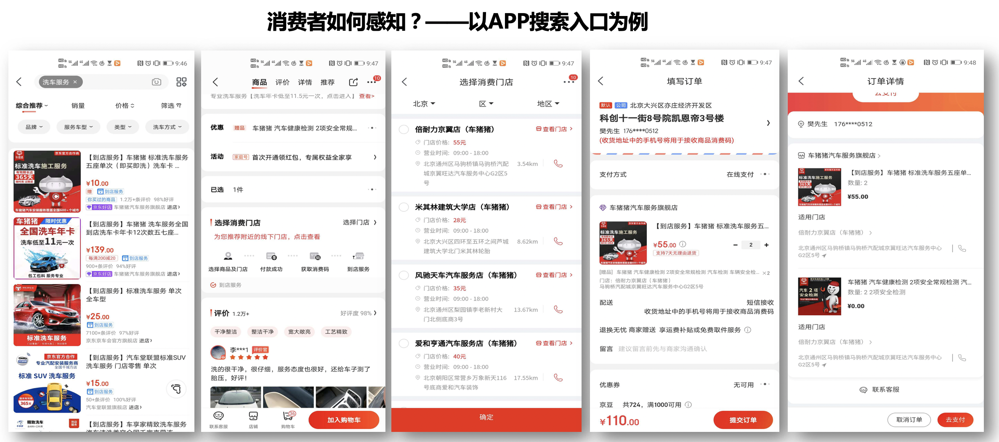


（2） 通过频道页，通过分类寻找点击下单，支付成功后获得验证码及短信。
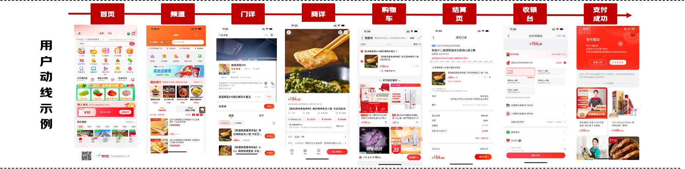
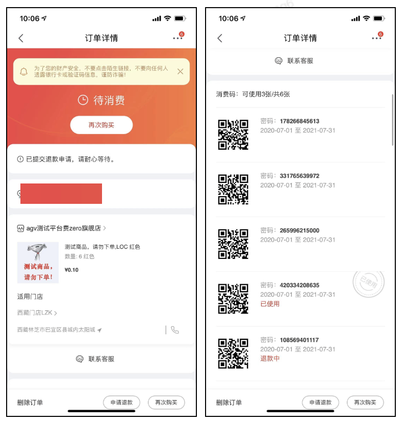


（3） 顾客持核销码到店核销，商家可通过京麦/门店帮/shop端进行核销：
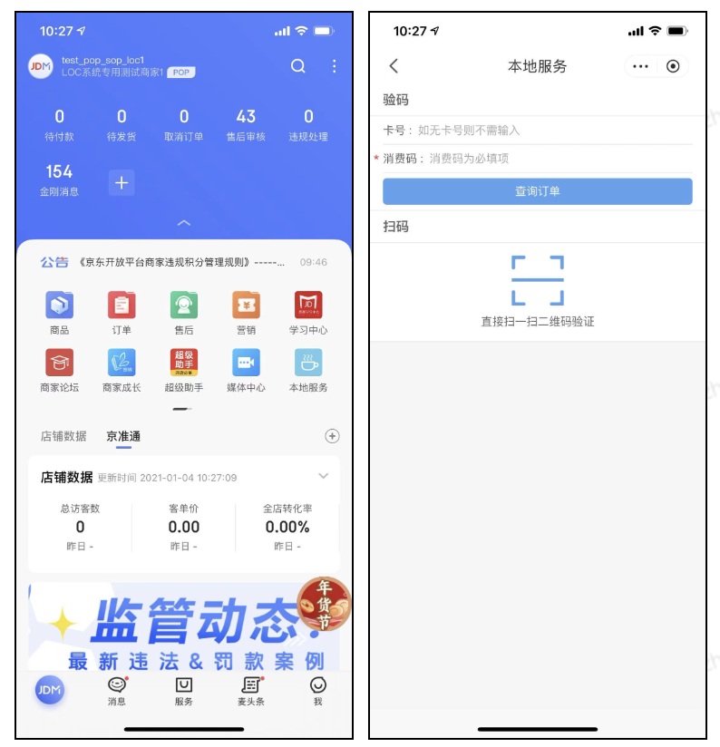
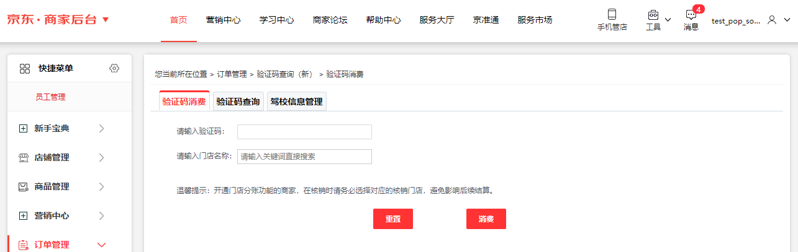

整个下单流程，比传统的实物下单在页面上多了门详页，其他方面在下单流程中没有太大的变化，不过针对到店属性的不同系统方面其实做了很多的工作，除了我们独立的频道页中是定制化的搜索能力，其它的比如主搜在LOC这方面也有一定的修改，后续咱们也可能会针对到店的业务有所修改，来提高到店商品和门店的曝光力度，当前LOC的修改比如：

- 搜索页当前搜索的逻辑是识别到到店的商品考虑门店因素，做了排序优化。
- 商品详情页：识别到isloc=1且locfwlx包含 1时，按照lbs展示最近门店，用户不需要选择任何门店。
- 门店列表页文档：APP嵌入loc门店选择列表页
- 购物车中台和结算中台，识别到locfwlx包含 1，不校验门店ID。
- 订单页识别到locfwlx包含 1，按照lbs展示最近的门店。
- 商品详情页和订单页：通过经纬度和门店组获取最近门店接口：LOC附近门店(根据门店组ID、经纬度查询最近门店数据)


#### 生产履约

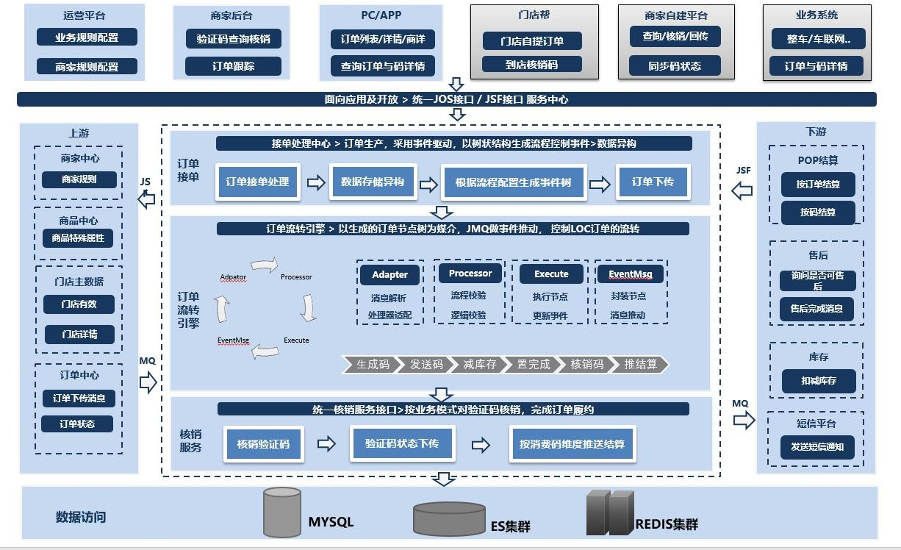
不同于实物配送订单，到店订单生产履约的流程这里有很大的不同，我们从架构图也可以看出，到店订单的生产流程是，支付成功后，订单中心下发MQ到了POP-LOC订单。然后POP-LOC订单系统做了一系列的处理。

在开始的名词解释中我们说道了生产节点，到店订单的生产过程其实就是对上边生产节点的编排与执行，下面我们透过生产节点来说一下他的业务流程，首先订单支付成功后，POP-LOC系统接到订单消息，那它怎样找到自己的规则流程，然后执行所需的节点呢，这个时候他其实是获取到了订单上的规则ID，这个规则ID是怎样设置在订单上的，下面我来详细讲述一下。

首先运营会在man端进行业务规则的配置。
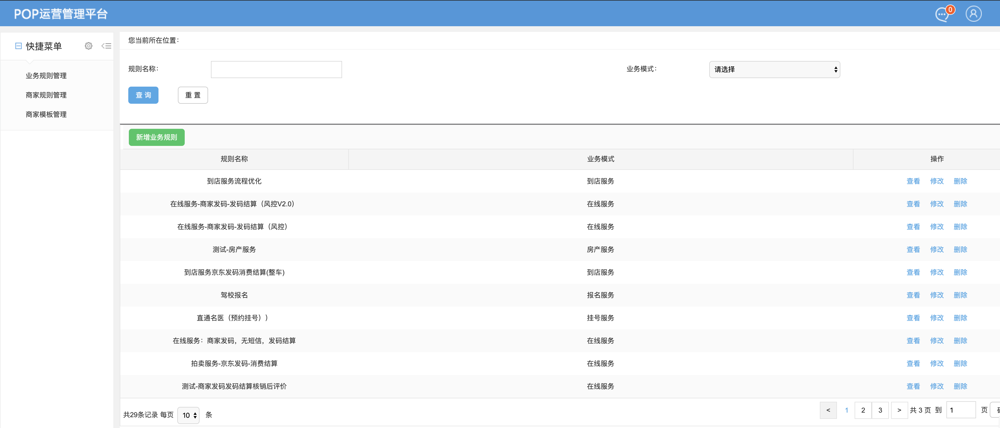

点击“新增业务规则”，可以按照业务的流程对生产节点进行组合，生成新的业务规则。
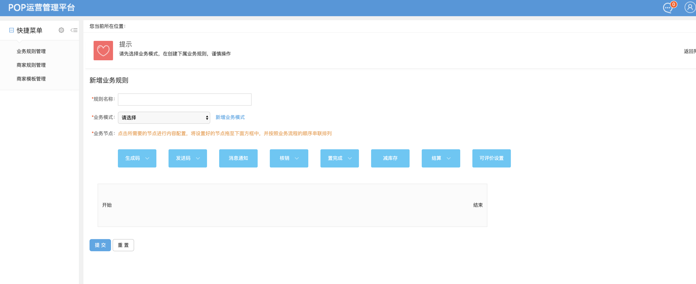

业务规则是根据业务实际生产流程将生产节点进行组合，比如常用的到店服务京东发码消费结算。
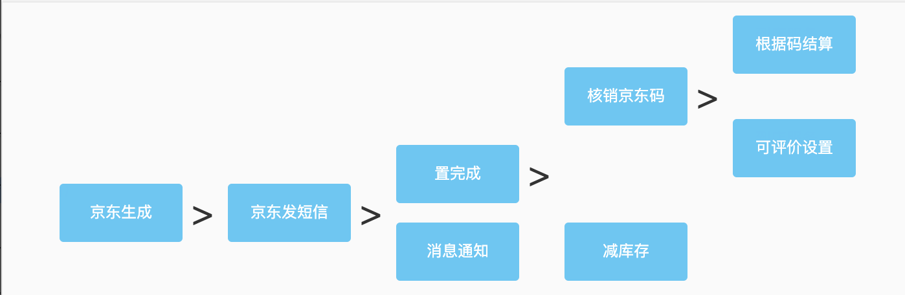

业务规则创建完成后，我们需要将业务规则绑定业务模式```见名词解释```，然后绑定到商家上。商家绑定业务模式和对应规则后，可创建已开通的业务模式的商品，业务规则会以rule_id的形式自动记录在商品上，存储在POP商品中心。

业务规则最终需要记忆在订单维度上，因此到店订单在支付成功下传至POP订单系统时，POP-LOC订单系统会调用POP商品中心接口读取rule_id，并将快照记录在订单上，以供生产流程识别使用。

接下来我们说一下生产节点，生产节点是到店或者说是LOC不同于实物订单的地方，

##### 生产节点——生成码

###### 一般业务逻辑

根据发码主体不同，LOC支持两种发码方式：京东发码和商家发码。

l  京东生成码：在订单支付成功下传至POP时，LOC订单系统根据订单自动生成验证码。

  验证码格式：12位纯数字验证码，在每个商家下验证码不可重复。

  验证码规则：对于每个订单来说，生成码数量=订单中所包含sku数量，sku与验证码一一对应。

  验证码状态：验证码生成后，初始状态为未消费。

  验证码有效期：验证码有效期在发布商品时设置，保存在POP商品中心。LOC订单在支付成功下传至POP时，LOC订单系统会调用POP商品中心接口读取有效期，并将快照记录在订单上，在验证码生成后随即记录在验证码上，后续用于判断验证码是否可有效消费。

l  商家生成码：在订单支付成功下传至POP时，商家根据订单生成验证码，上传至LOC系统。

  验证码格式：0~25位，支持数字、字母、下划线，支持卡号（非必选）+密码（必选）形式，在每个商家下卡号+密码不可重复。

  验证码规则：对于每个订单来说，生成码数量=订单中所包含sku数量，sku与验证码一一对应。

  验证码上传：在订单支付成功下传至POP时，商家可通过商家后台/jos接口获取订单，根据订单生成验证码，上传至LOC系统。

²  商家后台上传：在商家后台-订单管理-验证码查询菜单中，商家可操作验证码发送功能，默认向商家筛选展示所有待发码订单，商家可手动输入卡号和密码，sku数量多时以#分隔，一次必须输入与sku数量相等的卡密，才可成功上传。

²  Jos接口上传：商家定时轮询京东接口，获取loc未发码订单（订单状态为暂停的订单），然后调用商家回传验证码接口，将验证码回传到LOC系统。

备注： 1） jingdong.pop.order.search    

根据条件检索订单信息 

订单类型：ordeType=75；订单状态：orderState= POP_ORDER_PAUSE POP暂停。

     2） jingdong.pop.oto.checkNumbers.upload

商家回传验证码

order_id订单号，card_number卡号(若卡号为多个，用英文逗号隔开)，pwd_number密码(若密码为多个，用英文逗号隔开)。
  验证码状态：验证码生成后，初始状态为未消费。

  验证码有效期：验证码有效期在发布商品时设置，保存在POP商品中心。LOC订单在支付成功下传至POP时，LOC订单系统会调用POP商品中心接口读取有效期，并将快照记录在订单上，在验证码生成后随即记录在验证码上，后续用于判断验证码是否可有效消费。

###### 特殊业务逻辑
l  套装搭售延迟发码逻辑：当用户以套装形式购买实物+LOC商品时，在确认实物订单已妥投后进行LOC发码，非妥投情况则均不发码，逻辑说明如下。

  订单截停：订单经Ofw下传至POP时，LOC系统判断OrderType=75，Sendpay111=1时，判断为套装搭售订单，将订单截停暂不发码；否则则走正常发码流程。

  延迟发码：订单为截停状态时，当OFC消息通知实物订单为妥投状态时，则进行LOC订单发码。

##### 生产节点——发短信

###### 一般业务逻辑
l  短信分类：根据内容和功能不同，LOC订单短信可分为以下三种：

  发码短信：适用于有验证码的业务模式，包括在线服务、到店服务、视频服务。向用户触达验证码信息，以供用户去使用和消费。京东发码场景下，在验证码生成后发送；商家发码场景下，在商家上传验证码之后发送。

  核销短信：适用于有验证码的业务模式，包括在线服务、到店服务、视频服务。向用户触达验证码核销情况，以给用户消费提示和确认。在验证码被核销时发送。

  业务短信：向用户触达特殊的业务信息，引导用户进行服务和消费。在订单完成时发送。目前到店服务、报名服务、房产服务、宽带服务有特殊业务信息。

l  客户重发短信：客户在PC端订单详情页中，可操作给自己重新发送短信，发送手机号为该订单手机号，不可给别的手机号发送，重发最多3次。

  已生成或者已上传的验证码支持重发。

  未消费和已过期状态的验证码支持重发。


l  客服重发短信：客服在man端，可操作给用户重新发送短信，发送手机号为该订单手机号，不可给别的手机号发送，重发没有次数限制。

  已生成或者已上传的验证码支持重发。

  未消费和已过期状态的验证码支持重发。

##### 生产节点——码核销

###### 一般业务逻辑
l  核销规则：核销是按照验证码维度，只能由商家发起，核销时将验证码状态由未消费置为已消费。

  仅未消费状态下的验证码能正确进行核销；

  已过期的验证码无法进行核销，这种情况下可对验证码进行延期，然后操作核销。

操作路径：订单管理 > 验证码查询（新） > 验证码查询 点击“延期消费码”，每次延期为10天。

l  核销方式：根据渠道不同，支持以下五种方式操作核销：

  商家后台核销：在商家后台-订单管理-验证码查询菜单中，商家可操作验证码消费功能，每次只可核销一个验证码，核销时所输入的验证码或卡密必须与生成或上传时的完全一致。

²  到店服务的订单核销时必须输入消费门店，消费门店不一定与预约门店相同。

²  门店分账的订单核销时必须输入消费门店，否则无法正常分账。

  Jos接口核销：服务完成后，商家可调用验证码消费接口，将验证码在京东系统中核销。

3）jingdong.pop.oto.CheckNumber.consumer    消费验证码

order_id，card_number，pwd_umber，shop_id，shop_name，code_type
  
  400电话核销：步骤如下：

1. 欢迎致电京东本地生活验证系统

2. 请输入商家门店ID号以#号键结束

3. 您输入的号码有误请重新输入，以#号键结束

4. 您已输入错误号码三次，请确认后再拨，谢谢，再见

5. 请输入12位消费码以#号键结束

6. 无此消费码，请重新输入以#号键结束

7. 验证成功，确认使用请按1，验证其他请按2

8. 已成功记录此消费码，继续验证请按1，结束请挂机

9. 此消费码已被使用，验证失败，验证其他请按1，结束请挂机

  京麦核销：在京麦工作台-首页-本地生活菜单中，商家可手动输入验证码进行核销。

  门店帮核销：针对特权定金订单，只可在门店帮微信助手中进行核销。核销时输入验证码，门店帮系统调用LOC接口读取特权定金的代金金额，然后进行核销。

##### 生产节点——订单状态变更

###### 一般业务逻辑
l  订单置完成：

发码置完成：针对有验证码的业务模式，包括在线服务、到店服务、视频服务。在订单发送验证码后，POP-LOC订单系统调用交易-订单中心订单状态变更接口，将订单状态置为完成。

  支付置完成：针对没有验证码的业务模式，包括报名服务。在订单支付成功下传到POP订单系统后，POP-LOC订单系统调用交易-订单中心订单状态变更接口，将订单状态置为完成。

###### 特殊业务逻辑
l  订单延迟置完成：目前包括房产服务（延迟90天）、宽带服务（延迟20天）。在订单支付成功下传到POP订单系统后，POP-LOC订单系统将订单暂停，从订单下单时间开始计时，同时等待业务系统指令，当延迟时间计满或者收到业务系统指令时，调用交易-订单中心订单状态变更接口，将订单状态置为完成。


##### 生产节点——推送结算
###### 一般业务逻辑
l  有码结算：适用于有验证码的业务模式，目前包括在线服务、到店服务、视频服务。这类订单的计费时间点由LOC系统控制，由LOC系统推送消息给POP结算系统，触发订单计费流程，计费规则为sku维度，即验证码维度，有单独的计费逻辑。根据计费时间点不同，分为以下两种方式：

  发码即结算：当订单所有验证码生成成功后，LOC系统推送消息给POP结算系统，消息中包括该订单下所有验证码，触发订单计费流程，每次对一个订单进行计费。

  消费即结算：当订单中有验证码被消费时，LOC系统推送消息给POP结算系统，消息中包括当前被消费的验证码，触发订单计费流程，每次对一个验证码进行计费。推送消息时校验推送次数小于订单中所含验证码数量。

l  无码结算：适用于没有验证码的业务模式，目前包括报名服务、房产服务、宽带服务。这类订单的计费时间点为订单状态完成时，POP结算系统订阅订单完成消息来触发订单计费流程，计费规则为订单维度，同sop实物订单计费规则。  

#### 售前逆向
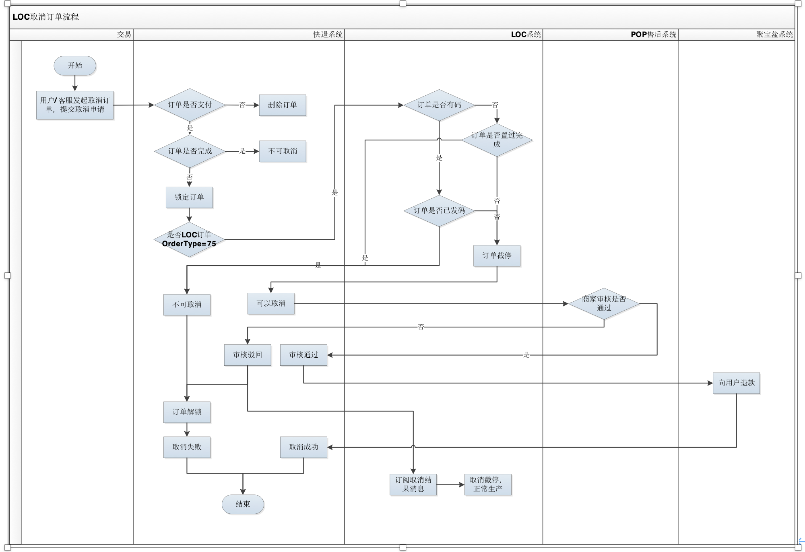
##### 一般业务逻辑
用户/客服发起，LOC订单以非套装形式购买时，取消逻辑如下：

l  前提：LOC所有业务模式订单，订单状态：支付之后完成之前，用户/客服可发起取消订单；

l  快退系统判断出上述条件订单后，则将订单锁定，并通过接口询问LOC系统订单是否可以取消；

l  LOC系统判断逻辑：判断订单为发码业务or不发码业务，通过rule_id中有无生成码节点进行判断。

  LOC不发码订单：判断订单状态是否置过完成，若置过则答复快退不可取消，若没置过则将订单截停，并答复快退可以取消；

²  订阅快退取消结果消息，若取消失败则将订单取消截停，继续生产，取消成功则订单结束；

  LOC发码订单：判断订单是否已发码，若已发则答复快退不可取消，若未发则将订单截停，并答复快退可以取消；

l  快退系统根据LOC系统返回的结果进行下一步操作：

  若可以取消：则将订单推送至POP售后系统，由商家进行审核，若24小时未审核则系统自动审核通过；

²  商家审核通过：快退将订单推送至聚宝盆系统，向用户进行退款，订单取消成功；

²  商家审核驳回：快退将订单解锁，取消失败；

  若不可取消：则将订单解锁，取消失败；

##### 特殊业务逻辑

  一、用户/客服发起，LOC订单以京腾套装形式购买时，联动取消逻辑如下：

l  订单截停判断：订单经Ofw下传至POP时，LOC系统判断OrderType=75，Sendpay111=1时，判断为套装搭售订单，将订单截停暂不发码；否则则走正常发码流程。

套装订单为截停状态时，会出现以下几种情况：

l  当OFC通知发码时（实物订单为妥投状态），判断快退是否询问过该单能否取消：

  若未询问过：进行发码；

  若询问过：答复不可取消，并进行发码；

l  当OFC通知取消时（实物订单为取消成功状态），判断快退是否询问过该单能否取消：

  若未询问过：调用快退接口发起取消；

  若询问过：答复可以取消；

l  当快退询问LOC订单能否取消时：

  若Sendpay111=1，判断OFC是否通知过该实物订单状态：

²  若未通知：等待OFC状态消息；

²  若通知实物已取消：答复可以取消；

²  若通知实物已妥投：答复不可取消，并进行发码；

  若Sendpay111不为1，则按照LOC单独取消流程进行判断，向快退返回结果；

流程图如下：
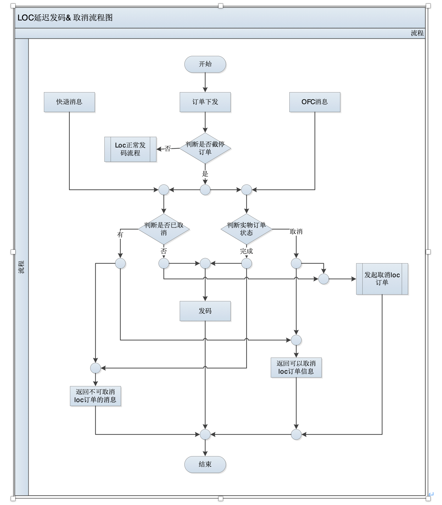

二、商家发起，LOC订单以非套装形式购买时，取消逻辑如下：

l  前提：仅限宽带服务订单，订单状态：支付之后完成之前，商家可发起删单申请；

l  流程：商家在shop端发起删单申请，后台自动发送短信通知用户， 48小时后订单自动删除，48小时内用户若不同意删除，则联系客服，客服可在Man端操作将删单申请驳回。

#### 售后逆向
##### 一般业务逻辑
LOC订单售后方式由结算方式决定，发码即结算无法售后，消费即结算在验证码未消费时可以售后，具体逻辑如下：

l  未消费售后：消费即结算商家，验证码状态为未消费和已过期时，用户/客服可发起售后。服务单按照sku维度进行申请，每个售后服务单生成后，售后系统调用LOC系统将任一可售后验证码状态置为退款锁定，订单状态不发生变化。

  仅适用于有验证码的业务模式，包括在线服务、到店服务、视频服务。

发码即结算和消费即结算商家在一定条件下，客服均可进行先行赔付，具体逻辑如下：

l  赔付规则：验证码为已消费状态下，才可发起先行赔付，赔付类型：POP赔付-LOC先行赔付。

  仅适用于有验证码的业务模式，包括在线服务、到店服务、视频服务。

##### 特殊业务逻辑
订单下单时LOC有两个售后方式标记位，分别是：售后入口（支持客服、支持客服/客户、都不支持、业务系统控制），售后规则（有码售后、无码售后），通过标记位可控制LOC订单售后流程。

l  房产服务售后：无码售后，LOC系统控制入口，下单7天内支持用户/客服申请，7天后支持客服申请。

l  宽带服务售后：无码售后，支持客服入口。

#### 订单详情页网关

##### 业务场景
LOC的不同业务模式需要在订单详情页展示不同的信息，因此，LOC订单详情页需要根据业务模式做对应的跳转。

##### 一般业务逻辑
l  跳转逻辑：当用户在PC端订单列表页针对LOC订单点击【查看详情】时，交易系统-订单中心识别出是LOC订单类型（OrderType=75），则跳转至LOC网关，网关通过识别商品上的业务模式标识，重定向至该模式对应的订单详情页链接。

l  订单详情页类别：

  在线服务、到店服务、视频服务：共用订单详情页，有码信息；

  报名服务：单独订单详情页，无码，有特殊业务信息；

  房产服务：单独订单详情页，无码，有特殊业务信息；

  宽带服务：单独订单详情页，无码，有特殊业务信息。

#### 最后说说有问题如何排查

