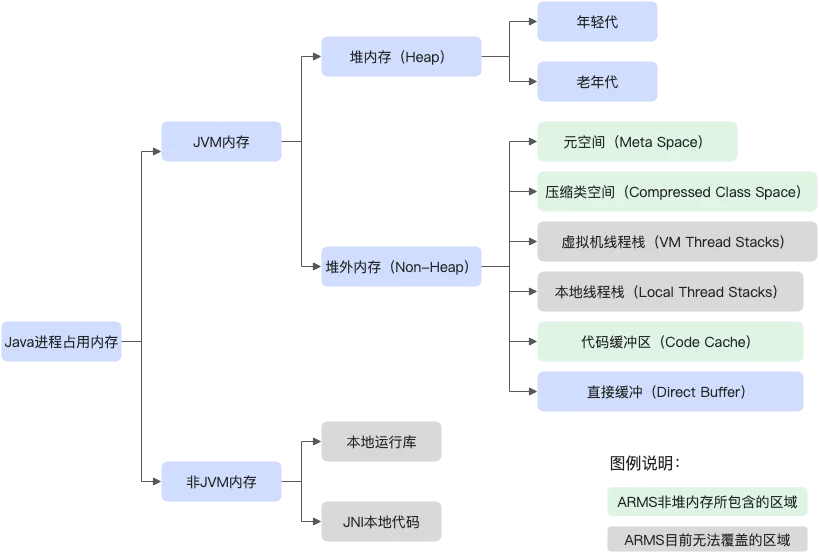

### 背景介绍
系统稳定性方面很大一部分是通过监控来支持，一般大型公司都有比较完善的监控运维团队来进行监控基础设施的建设，从分层的角度上看，监控一般包含以下几个方面：
| 监控维度   | 监控核心内容             | 监控核心指标                 |
| ---------- | ------------------------ | ---------------------------- |
| 物理资源   | 网络、物理机、容器       | 服务器、网络、存储性能和状态 |
| 中间件     | 数据库、文件、缓存       | 性能、连接、慢查询           |
| 日志       | 集中化日志管理与查询     | 错误日志数                   |
| 分布式追踪 | 务调用链分析与故障定位   | 调用链路性能                 |
| 报警与通知 | 实时报警并支持多通道通知 | 指标告警实时通知             |

### 选型最佳实践
中小型公司可以结合自己的业务特点，快速的搭建一套适合自己的监控体系，当前普罗米修斯已经成为了监控实时上的标准，我们可以基于普罗米修斯快速搭建一套属于自己的监控体系：
| 监控维度   | 监控中间件选型                            | 选型理由                                    |
|--------|-------------------------------------------|-----------------------------------------|
| 指标监控   | Prometheus + Grafana                      | 持多种 Exporter，生态丰富，易于配置报警和可视 |
| 日志监控   | Loki + Promtail/Fluent Bit                | 轻量级日志聚合方案，与 Grafana 无缝集成      |
| 分布式追踪 | OpenTelemetry + Jaeger                    | 放标准的分布式追踪解决方案，支持多语言       |
| 数据库监控 | xporter（如 MySQL Exporter、Redis Exporter） | Prometheus 官方或社区维护，支持主流数据库    |
| 网络监控   | Blackbox Exporter                         | 支持 HTTP、TCP 等多协议健康检查              |
| 报警与通知 | Alertmanager                                 |   支持多渠道通知（邮件、Slack、Webhook、短信等） |    

### 体系架构设计
+--------------------+       +-----------------------+
|   Exporters        | ----> |   Prometheus          |
| (Node, MySQL, etc) |       | (Metrics Collection)  |
+--------------------+       +-----------------------+
^                                |
|                                v
+--------------------+       +-----------------------+
|  Application Logs  | ----> | Loki (Log Aggregation)|
+--------------------+       +-----------------------+
^                                |
|                                v
+--------------------+       +-----------------------+
|  Services (Tracing)| ----> | Jaeger (Tracing)      |
+--------------------+       +-----------------------+
|                                |
v                                v
+--------------------+       +-----------------------+
|  Blackbox Exporter | ----> | Grafana (Visualization|
| (Health Checks)    |       |   and Alerts)         |
+--------------------+       +-----------------------+

### 定义细化的监控指标
#### JVM监控

JVM监控功能用于监控重要的JVM指标，包括GC（Garbage Collection）瞬时指标、堆内存指标、非堆内存指标、元空间指标、直接缓冲区指标、JVM线程数等。本文介绍JVM监控功能和查看JVM监控指标的操作步骤。

JVM监控功能可监控以下指标：

- GC（垃圾收集）瞬时和累计详情
    - FullGC次数
    - YoungGC次数
    - FullGC耗时
    - YoungGC耗时
- 堆内存详情
    - 堆内存总和
    - 堆内存老年代字节数
    - 堆内存年轻代Survivor区字节数
    - 堆内存年轻代Eden区字节数
- 元空间
    
    元空间字节数
    
- 非堆内存
    - 非堆内存最大字节数
    - 非堆内存使用字节数
- 直接缓冲区
    - DirectBuffer总大小（字节）
    - DirectBuffer使用大小（字节）
- JVM线程数
    - 线程总数量
    - 死锁线程数量
    - 新建线程数量
    - 阻塞线程数量
    - 可运行线程数量
    - 终结线程数量
    - 限时等待线程数量
    - 等待中线程数量

#### 主机监控

主机监控功能用于监控CPU、内存、Disk（磁盘）、Load（负载）、网络流量和网络数据包的各项指标。本文介绍主机监控功能和查看主机监控指标的操作步骤。

主机监控功能可监控以下指标：

- CPU
    - CPU使用率总和
    - 系统CPU使用率
    - 用户CPU使用率
    - 等待IO完成的CPU使用率
- 物理内存
    - 系统总内存
    - 系统空闲内存
    - 系统已使用内存
    - 系统PageCache中的内存
    - 系统BufferCache中的内存
- Disk（磁盘）
    - 系统磁盘总字节数
    - 系统磁盘空闲字节数
    - 系统磁盘使用字节数
- Load（负载）
    
    系统负载数
    
- 网络流量
    - 网络接收的字节数
    - 网络发送的字节数
- 网络数据包
    - 每分钟网络接收的报文数
    - 每分钟网络发送的报文数
    - 每分钟网络接收的错误数
    - 每分钟网络丢弃的报文数
    
#### **SQL调用分析**

查看SQL调用分析，从而了解应用的SQL调用情况。

#### 异常和错误码监控

例如支付等核心业务系统需要进行错误码监控